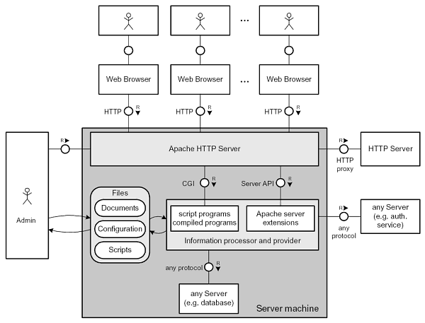

# Real assignment 1 (ra01)
Set up a real web server!


## Deliverables
* `src/apache_setup.sh`
* `uploads/iactuallytestedthis-apache_setup.png`
* `uploads/wireshark_cap_web.pcapng` (this is not a PNG image file!)
* `uploads/report.md`

## Part 0: 
Watch this good documentary on Apache's beginnings:
* https://www.youtube.com/watch?v=JUt2nb0mgwg (broken / made private)
* https://www.bilibili.com/video/BV1Uz411i7MH/?uid=425631557A34313169374D48 (anyone know how to download the file from bilibili?)
[ ] Use newpipe or pipepipe to download this?

Read some general background on Apache:
* https://www.apache.org/
* https://httpd.apache.org/
* https://en.wikipedia.org/wiki/Apache_HTTP_Server

Specific information about administering Apache
* https://httpd.apache.org/docs/2.4/

Apache on Fedora (where we grade):
* https://docs.fedoraproject.org/en-US/fedora/rawhide/system-administrators-guide/servers/Web_Servers/
* https://docs.fedoraproject.org/en-US/quick-docs/getting-started-with-apache-http-server/index.html
* https://access.redhat.com/documentation/en-us/red_hat_enterprise_linux/8/html-single/deploying_different_types_of_servers/index#setting-apache-web-server_Deploying-different-types-of-servers

Apache on Debian (just fyi)
* https://wiki.debian.org/Apache
* https://wiki.debian.org/CGI

How to use the `chmod` command:
* https://cs-mst.gitlab.io/index/Classes/Security/Content/19b-Permissions.html

Manual entries for commands you might use:
```bash
man cp
man chmod # symbolic recommended over numeric!
man httpd # Fedora
man apache2 # Debian
man systemctl
man service
man apachectl # Fedora (and Debian's is aliased)
man apache2ctl # Debian
man a2enmod # Debian
```

Note: 
It is much easier to develop and test this assignment locally.
Do it on your own machine first!

## Testing
Make sure to only test on a clean snapshot (or docker container).
That is, don't run the autograder or apache on a persistent machine.
If you do, then runnnig the autograder again, 
your script may appear to be working, and yet not be.
Snapshot BEFORE doing this assignment,
save your files in a shared folder,
and then run the autograder only after refreshing each snapshot.

## Part 1: Install and configure a real Web server
* Using your VM install and set up an Apache web-server.
* Install Apache, enable Apache, check out the default website.
* Set permissions on web directories (see reading above).
* Create various html files and scripts in the required directories.
* Verify it's functionality by visiting your new website from localhost.

## Part 2: Wireshark for HTTP details!
* Start up Wireshark, observe the traffic from queries to your new website.

In the `uploads/report.md` answer these questions:
* Is the traffic TCP or UDP?
* Follow a TCP "stream"
* Can you read the HTTP data?
* Is it encrypted?

## Part 3 CGI?

Set up server-side code execution, GET input
* https://httpd.apache.org/docs/2.4/howto/cgi.html
* https://www.tutorialspoint.com/python/python_cgi_programming.htm
* https://wiki.debian.org/CGI
* After completing the basic parts, visit: http://localhost/python_post.html and enter something in the form!

## Part 4 (optional for fun)
* The only thing left to make this a real live site is to host publicially.
    * get an externally facing IP, and alternatively to get a domain name.
    * Or, get an externally facing onion or garlic address to host your site for free: 
        * https://2019.www.torproject.org/docs/tor-onion-service
        * https://geti2p.net/en/docs/applications/supported#web-servers
* Firewall configuration will depend on your setup (you don't need this on localhost).

## Part 5: write up
Write a `report.md` which includes
* the above screenshots, so that they are visible in the git-classses web interface, and 
* descriptions of each screenshot
* any extra notes about your setup.

## Hints:
On the remote docker container, (or the local one),
the command availability is a bit different.
Docker containers are not generally persistent machines.
Thus, they do not have commands like `systemctl`,
and you will need to run Apache directly.
To see how Apache is run by systemctl,
run Apache, and then check on it with a `ps -aux` command,
for example.
